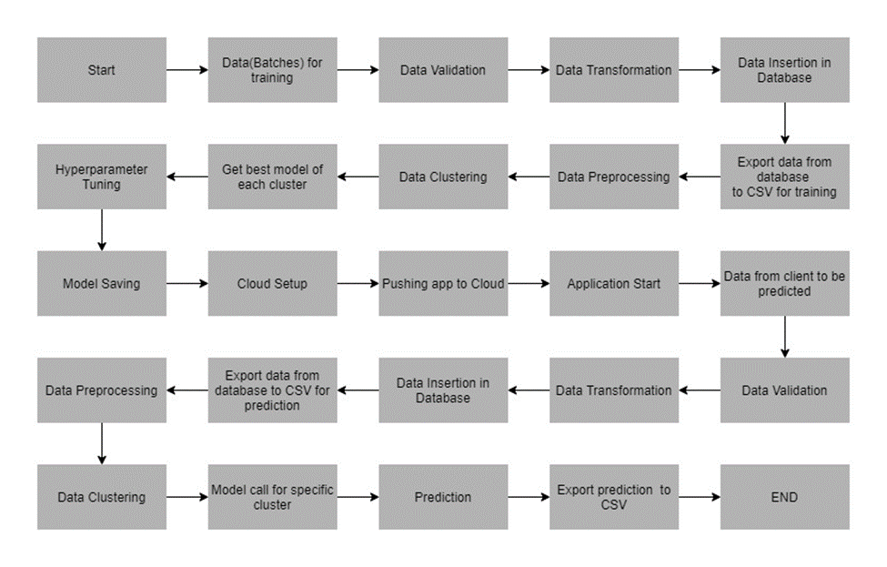

# Cement Strength Prediction

## Table Content
- Introduction
- Data Description
- Data Validation
- Data Insertion Into Database
- Model Training
- Model Approach
- User Interface
- Installation
- Creating Docker File
- Create Procfile
- Create .circleci/config.yml File
- Create Requirements.txt
- Initialize Git Repo
- Setting The Below Variable Inside CircleCi 
- Technology Used

## Introduction
```
In the given project we are predicting the cement strength from the given component that are required
to create concrete. In these project we find out the concrete compressive strength. It is quantitative 
value in nature which measure in Mega Paskel. The input parameter value are given in terms of Kg in m^3 
mixture.

```

## Data Description
```
The given model is regression model because of the target variable is continous value. The input 
parameter are given are as follow. Total 9 feature are given out of that only
8 are the input feature aur input attribute and last one is target feature that
we have to predicted by using regression algorithem.
1. Cement
2. Blast Furance Slag
3. Fly Ash
4. Water
5. Super-Plasticizer
6. Coarse-Aggregate
7. Fine-Aggregate
8. Age
9. Concrete Compressive Strength
```


## Data Validation
```
In This step, we perform different sets of validation on the given set of training files.

Name Validation: We validate the name of the files based on the given name in the schema file. We 
have created a regex patterg as per the name given in the schema fileto use for validation. After 
validating the pattern in the name, we check for the length of the date in the file name as well 
as the length of time in the file name. If all the values are as per requirements, we move such 
files to "Good_Data_Folder" else we move such files to "Bad_Data_Folder."

Number of Columns: We validate the number of columns present in the files, and if it doesn't match 
with the value given in the schema file, then the file id moves to "Bad_Data_Folder."

Name of Columns: The name of the columns is validated and should be the same as given in the schema 
file. If not, then the file is moved to "Bad_Data_Folder".

The datatype of columns: The datatype of columns is given in the schema file. This is validated when
we insert the files into Database. If the datatype is wrong, then the file is moved to 
"Bad_Data_Folder."

Null values in columns: If any of the columns in a file have all the values as NULL or missing, we 
discard such a file and move it to "Bad_Data_Folder".
```

## Data Insertion Into Database
```
Database Creation and Connection: Create a database with the given name passed. If the database is 
already created, open the connection to the database.
 
Table creation in the database: Table with name - "Good_Data", is created in the database for inserting 
the files in the "Good_Data_Folder" based on given column names and datatype in the schema file. If 
the table is already present, then the new table is not created and new files are inserted in the 
already present table as we want training to be done on new as well as old training files.
 
Insertion of file in the table: All the files in the "Good_Data_Folder" are inserted in the 
above-created table. If any file has invalid data type in any of the columns, the file is not loaded
in the table and is moved to "Bad_Data_Folder".
```

## Model Training
```
Data Export from Db: The data in a stored database is exported as a CSV file to be used for model 
training.
 
Data Preprocessing: 
    Check for null values in the columns. If present, impute the null values using the KNN imputer.
    
    Check if any column has zero standard deviation, remove such columns as they don't give any 
    information during model training.
    
Clustering: KMeans algorithm is used to create clusters in the preprocessed data. The optimum number
of clusters is selected
```

## Approach



## User Interface

> Home Page

.png)

> Training / Prediction Page

.png)

## Installation

The Code is written in Python 3.7.11. If you don't have Python installed you
can find it [your link here](https://www.python.org/downloads/). If you are 
using a lower version of Python you can upgrade using the pip package, 
ensuring you have the latest version of pip. To install the required packages
and libraries, run this command in the project directory after 
[cloning](https://docs.github.com/en/github/creating-cloning-and-archiving-repositories/cloning-a-repository) the repository.

### To Create Conda Environment

```commandline
conda create "Your Env name" python==3.7
```

## Create A File "Dockerfile" With Below Content

```
FROM python:3.7
COPY . /app
WORKDIR /app
RUN pip install -r requirements.txt
ENTRYPOINT [ "python" ]
CMD [ "main.py" ]
```

## Create A "Procfile" With Following Content

```
web: gunicorn main:app
```

## Create A File ".circleci\config.yml" With Following Content

```
version: 2.1
orbs:
  heroku: circleci/heroku@1.0.1
jobs:
  build-and-test:
    executor: heroku/default
    docker:
      - image: circleci/python:3.6.2-stretch-browsers
        auth:
          username: mydockerhub-user
          password: $DOCKERHUB_PASSWORD  # context / project UI env-var reference
    steps:
      - checkout
      - restore_cache:
          key: deps1-{{ .Branch }}-{{ checksum "requirements.txt" }}
      - run:
          name: Install Python deps in a venv
          command: |
            echo 'export TAG=0.1.${CIRCLE_BUILD_NUM}' >> $BASH_ENV
            echo 'export IMAGE_NAME=python-circleci-docker' >> $BASH_ENV
            python3 -m venv venv
            . venv/bin/activate
            pip install --upgrade pip
            pip install -r requirements.txt
      - save_cache:
          key: deps1-{{ .Branch }}-{{ checksum "requirements.txt" }}
          paths:
            - "venv"
      - run:
          command: |
            . venv/bin/activate
            python -m pytest -v tests/test_script.py
      - store_artifacts:
          path: test-reports/
          destination: tr1
      - store_test_results:
          path: test-reports/
      - setup_remote_docker:
          version: 19.03.13
      - run:
          name: Build and push Docker image
          command: |
            docker build -t $DOCKERHUB_USER/$IMAGE_NAME:$TAG .
            docker login -u $DOCKERHUB_USER -p $DOCKER_HUB_PASSWORD_USER docker.io
            docker push $DOCKERHUB_USER/$IMAGE_NAME:$TAG
  deploy:
    executor: heroku/default
    steps:
      - checkout
      - run:
          name: Storing previous commit
          command: |
            git rev-parse HEAD > ./commit.txt
      - heroku/install
      - setup_remote_docker:
          version: 18.06.0-ce
      - run:
          name: Pushing to heroku registry
          command: |
            heroku container:login
            #heroku ps:scale web=1 -a $HEROKU_APP_NAME
            heroku container:push web -a $HEROKU_APP_NAME
            heroku container:release web -a $HEROKU_APP_NAME

workflows:
  build-test-deploy:
    jobs:
      - build-and-test
      - deploy:
          requires:
            - build-and-test
          filters:
            branches:
              only:
                - main
```

## Create Requirements.txt File

```commandline
pip install -r requirements.txt
```

## Initialize Git Repository

```
git init
git add README.md
git commit -m "first commit"
git branch -M main
git remote add origin https://github.com/mayurborkar/Wafer-Sensor-Fault-Detection.git
git push -u origin main
```
## Setting The Below Variable Inside CircleCi

>DOCKERHUB_USER

>DOCKER_HUB_PASSWORD_USER

>HEROKU_API_KEY

>HEROKU_APP_NAME

>HEROKU_EMAIL_ADDRESS

>DOCKER_IMAGE_NAME

## Technology Used
```
1.  Python
2.  Sklearn
3.  Pandas
4.  Numpy
5.  Flask
6.  HTML
7.  CSS
8.  JS
9.  SQLite
10. Heroku
11. Docker
12. CircleCi
```
